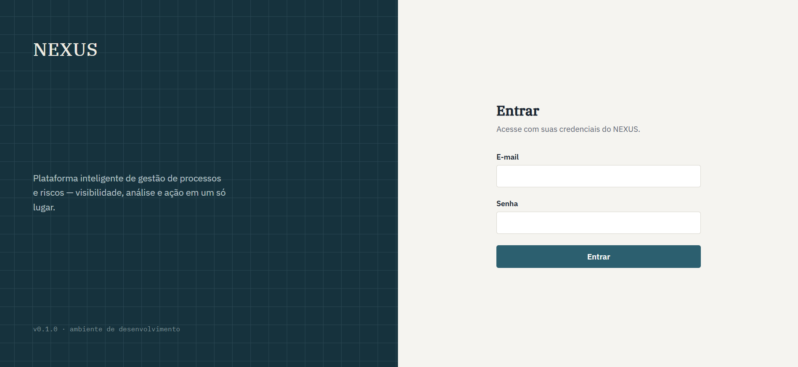
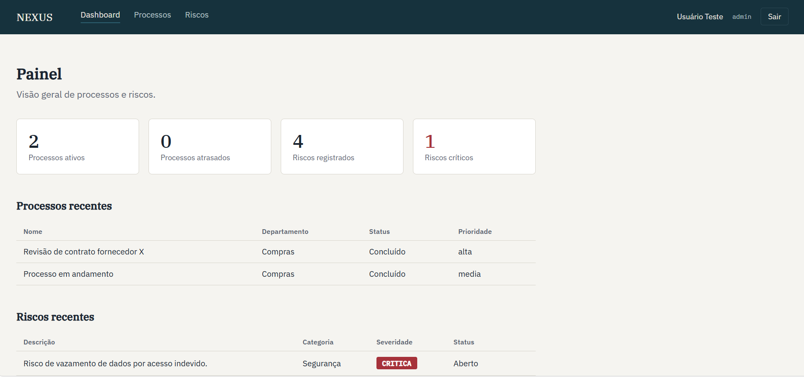
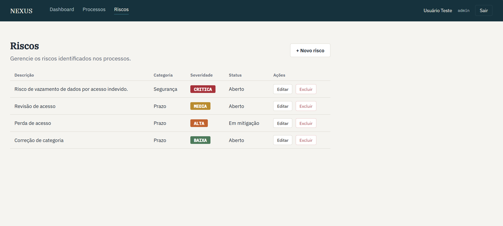
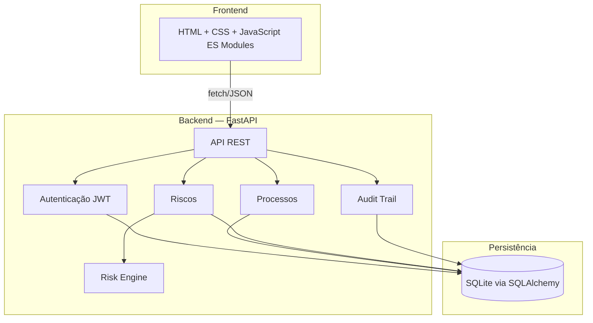

# NEXUS — Intelligent Process & Risk Platform


Plataforma inteligente de gestão de processos e riscos corporativos, com cálculo automático de severidade, autenticação segura e trilha de auditoria completa.

> Projeto de portfólio construído do zero, incluindo diagnóstico de ambiente restrito, arquitetura adaptativa, backend, frontend e testes automatizados.

## 📸 Screenshots

<table>
  <tr>
    <td><strong>Login</strong></td>
    <td><strong>Dashboard</strong></td>
  </tr>
  <tr>
    <td></td>
    <td></td>
  </tr>
  <tr>
    <td colspan="2" align="center"><strong>Gestão de riscos com severidade calculada automaticamente</strong></td>
  </tr>
  <tr>
    <td colspan="2"></td>
  </tr>
</table>

## 🎯 Problema

Ambientes corporativos lidam constantemente com processos operacionais e os riscos associados a eles — prazos, responsáveis, prioridades, e a necessidade de identificar rapidamente onde estão as maiores ameaças. Sem uma ferramenta centralizada, essa informação fica dispersa em planilhas, sem cálculo consistente de severidade e sem rastreabilidade de quem alterou o quê.

## 💡 Solução

O NEXUS centraliza processos e riscos em uma única plataforma, com:

- **Cálculo automático de severidade** via matriz de risco (Probabilidade × Impacto), eliminando julgamento manual inconsistente
- **Autenticação JWT** e controle de acesso
- **Trilha de auditoria** completa — toda criação, edição e exclusão é registrada com autor, data e o que mudou
- **Dashboard visual** com indicadores em tempo real e destaque automático para riscos críticos
- **API REST documentada** (OpenAPI/Swagger), pronta para integrações futuras

## 🏗️ Arquitetura



A aplicação segue arquitetura em camadas (API → Service → Repository → Model), separando claramente regras de negócio, acesso a dados e apresentação. Essa separação permite trocar o banco de dados (SQLite → PostgreSQL) sem reescrever a lógica de negócio.

### Uma nota sobre as decisões técnicas

Este projeto foi desenvolvido em um **ambiente corporativo com restrições reais**: sem Node.js, sem Docker, sem PostgreSQL, e com políticas de execução (AppLocker) bloqueando até mesmo binários instalados via `pip` em alguns casos. Em vez de contornar essas restrições, a arquitetura foi adaptada para funcionar dentro delas — o que resultou em decisões deliberadas, documentadas ao longo do código:

- **Backend em Python/FastAPI** (não Node/NestJS) — único runtime confirmado disponível
- **Frontend sem build step** (HTML/CSS/JS puro com ES Modules, servido via `python -m http.server`) — sem depender de Node/npm
- **SQLite com SQLAlchemy + Alembic** — abstração que permite migrar para PostgreSQL trocando apenas a connection string

## ✨ Funcionalidades

- Autenticação JWT com hash de senha (bcrypt)
- CRUD completo de Processos (nome, categoria, departamento, status, prioridade, prazo)
- CRUD completo de Riscos, vinculados a processos
- **Risk Engine**: cálculo automático de severidade via matriz Probabilidade × Impacto (baseada em princípios da ISO 31000)
- Recálculo automático de severidade ao atualizar probabilidade/impacto
- Dashboard com indicadores (processos ativos, atrasados, riscos críticos) e badges visuais de severidade
- Trilha de auditoria (quem, quando, o quê mudou) para toda ação de escrita
- 29 testes automatizados (unitários e de integração)

## 🛠️ Stack técnica

**Backend:** Python, FastAPI, SQLAlchemy, Alembic, python-jose (JWT), passlib (bcrypt), Pydantic

**Frontend:** HTML5, CSS3, JavaScript (ES Modules) — sem framework/bundler

**Banco de dados:** SQLite (desenvolvimento), com caminho de migração para PostgreSQL

**Testes:** pytest, httpx, pytest-cov

## 📦 Estrutura do projeto

nexus/

├── backend/

│   ├── app/

│   │   ├── main.py

│   │   ├── core/          # configurações, segurança/JWT

│   │   ├── db/             # engine, sessão, base do SQLAlchemy

│   │   ├── models/         # entidades (User, Process, Risk, AuditLog)

│   │   ├── schemas/        # validação Pydantic

│   │   ├── repositories/   # acesso a dados

│   │   ├── services/       # regras de negócio (inclui o Risk Engine)

│   │   └── api/v1/         # rotas HTTP

│   ├── tests/

│   └── alembic/            # migrations versionadas

├── frontend/

│   ├── index.html          # login

│   ├── app.html            # dashboard

│   ├── processes.html

│   ├── risks.html

│   └── src/

│       ├── api/            # cliente HTTP

│       ├── pages/          # lógica de cada tela

│       └── styles/

└── docs/

├── ARCHITECTURE.md

└── screenshots/

## 🚀 Como executar

### Pré-requisitos

- Python 3.11+

### Backend

```bash
cd backend
python -m venv venv

# Windows
venv\Scripts\activate
# Linux/Mac
source venv/bin/activate

pip install -r requirements.txt

# Configurar variáveis de ambiente
copy .env.example .env      # Windows
cp .env.example .env         # Linux/Mac
# Edite o .env e defina uma SECRET_KEY própria

# Rodar migrations
python -m alembic upgrade head

# Iniciar o servidor
python -m uvicorn app.main:app --reload
```

A API estará em `http://127.0.0.1:8000`, com documentação interativa em `http://127.0.0.1:8000/docs`.

### Frontend

Em outro terminal:

```bash
cd frontend
python -m http.server 5500
```

Acesse `http://127.0.0.1:5500`.

## 🗄️ Banco de dados

O projeto usa SQLite por padrão, com todo o acesso a dados abstraído via SQLAlchemy — a migração para PostgreSQL exige apenas trocar a variável `DATABASE_URL` no `.env` e rodar as migrations no novo banco.

## 🧪 Testes

```bash
cd backend
python -m pytest -v
```

Cobertura inclui: autenticação, CRUD de processos e riscos, validação de regras de negócio (e-mail duplicado, processo inexistente), e a matriz completa do Risk Engine testada via `@pytest.mark.parametrize`.

## 📋 API — principais endpoints

| Método      | Endpoint                | Descrição                |
| ------------ | ----------------------- | -------------------------- |
| POST         | `/api/auth/login`     | Login (retorna JWT)        |
| GET          | `/api/users/me`       | Usuário autenticado       |
| GET/POST     | `/api/processes/`     | Listar/criar processos     |
| PATCH/DELETE | `/api/processes/{id}` | Atualizar/excluir processo |
| GET/POST     | `/api/risks/`         | Listar/criar riscos        |
| PATCH/DELETE | `/api/risks/{id}`     | Atualizar/excluir risco    |
| GET          | `/api/dashboard/`     | Indicadores agregados      |
| GET          | `/api/audit-logs/`    | Trilha de auditoria        |

Documentação completa e interativa em `/docs` (Swagger UI).

## 🗺️ Roadmap

- [ ] AI Service (análise semântica de texto para sugestão de categoria/severidade)
- [ ] Detecção de anomalias (crescimento de ocorrências por categoria)
- [ ] Copiloto conversacional sobre os dados
- [ ] Automação via webhooks (Teams, Power Automate)
- [ ] Exportação de relatórios (CSV, Excel, PDF)
- [ ] Docker Compose e CI/CD via GitHub Actions
- [ ] Migração de referência para PostgreSQL
- [ ] Portar frontend para React + TypeScript + Vite (atualmente vanilla JS por restrição de ambiente)

## 👤 Autor

Desenvolvido por Kayque Attico da Silva como projeto de portfólio.
