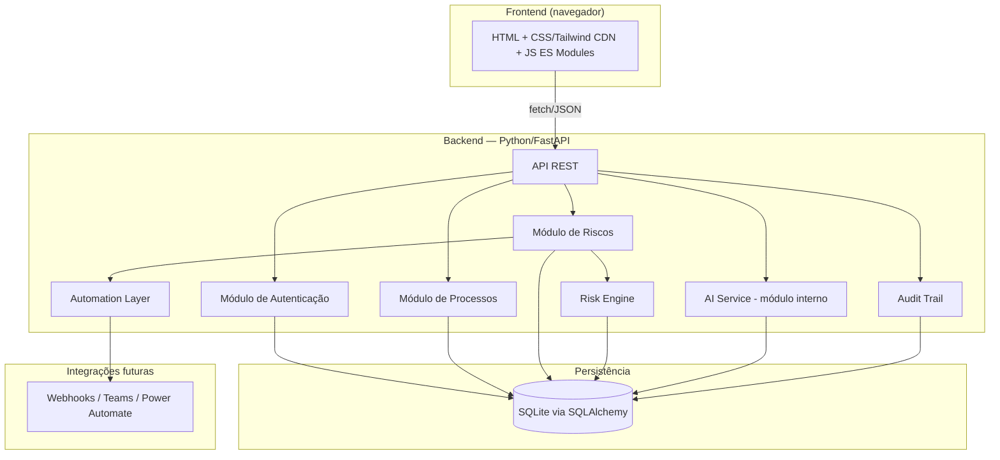
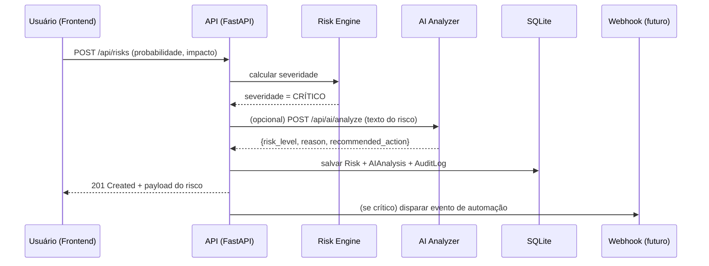

# NEXUS — Arquitetura Técnica (Fase 1)

> Documento vivo. Atualizado a cada fase do projeto conforme decisões técnicas são tomadas.

## 1. Contexto e restrições de ambiente

O ambiente de desenvolvimento (computador corporativo) tem as seguintes restrições confirmadas via diagnóstico:

- Node.js/npm: indisponíveis, e a execução de binários não autorizados é bloqueada por política (AppLocker/WDAC ou similar).
- Docker: indisponível.
- PostgreSQL: indisponível.
- Python 3.13 + pip: **disponíveis e funcionais**.
- Git: disponível.

Essas restrições definem a stack real da Fase 1 em diante. A arquitetura foi desenhada para funcionar **hoje**, nesse ambiente, e para migrar sem retrabalho caso restrições futuras sejam removidas (ex: banco trocado para PostgreSQL, ou frontend portado para React/Vite em outro ambiente).

## 2. Visão geral do sistema



## 3. Decisões arquiteturais

Cada decisão segue o formato **Problema → Alternativas → Decisão → Justificativa**, conforme solicitado.

### 3.1 Framework de backend

- **Problema:** precisamos de um backend robusto, tipado o quanto possível, com boa documentação de API, rodando em um ambiente sem Node.js.
- **Alternativas:** NestJS (Node), Express (Node), FastAPI (Python), Django (Python), Flask (Python).
- **Decisão:** FastAPI.
- **Justificativa:** é a única opção viável dado que Python é o único runtime confirmado. Entre as opções Python, FastAPI oferece tipagem via Pydantic (equivalente ao TypeScript em termos de validação e autocomplete), geração automática de documentação OpenAPI/Swagger, alta performance (async nativo) e é o padrão de mercado para APIs de IA/dados em Python — o que reforça a narrativa de portfólio ("AI Service" e "Backend" na mesma linguagem, mas em módulos desacoplados).

### 3.2 Banco de dados e ORM

- **Problema:** o banco precisa poder trocar de SQLite para PostgreSQL no futuro sem reescrever a aplicação.
- **Alternativas:** acesso direto via `sqlite3`/`psycopg2` (sem ORM), Prisma (não disponível sem Node), SQLAlchemy, Tortoise ORM.
- **Decisão:** SQLAlchemy (com Alembic para migrations).
- **Justificativa:** SQLAlchemy é database-agnostic — o código de acesso a dados (models, queries) não muda ao trocar o dialeto do banco; só a *connection string* muda. Alembic gerencia migrations de forma versionada, o que é essencial para simular um fluxo real de evolução de schema em produção. É o "Prisma do mundo Python" em termos de maturidade e adoção de mercado.

### 3.3 Frontend sem build step

- **Problema:** o frontend deveria usar React + TypeScript + Vite, mas isso depende de Node.js, indisponível e bloqueado no ambiente atual.
- **Alternativas:** (a) adiar todo o frontend até ter outro ambiente; (b) frontend "buildless" com HTML/CSS/JS moderno; (c) framework server-side em Python (ex: Jinja2 + HTMX).
- **Decisão:** (b) — HTML/CSS + Tailwind via CDN + JavaScript moderno com ES Modules, consumindo a API REST via `fetch`.
- **Justificativa:** mantém a separação clara frontend/backend (a API não sabe nada sobre como os dados são renderizados — o que facilita portar para React depois, se você tiver acesso a Node em outro ambiente). Evita bloquear o progresso do projeto. Com JS moderno (módulos, `async/await`, Web Components para componentização) e Tailwind, é possível entregar uma UI com aparência de produto SaaS sem ferramenta de build.
- **Nota de roadmap:** o contrato de API (JSON) será desenhado de forma que uma futura migração para React consuma exatamente os mesmos endpoints — nenhuma mudança de backend seria necessária.

### 3.4 AI Service: módulo interno vs. serviço separado

- **Problema:** o design original pedia um serviço de IA totalmente separado (outro processo/porta). Isso normalmente se beneficia de Docker Compose para orquestração, que está indisponível.
- **Alternativas:** (a) processo Python separado rodando em outra porta, orquestrado manualmente; (b) módulo interno do mesmo FastAPI, com fronteira de código isolada (pasta própria, interface abstrata).
- **Decisão:** (b) para a fase atual, com a interface desenhada para permitir extração para (a) sem reescrever a lógica interna.
- **Justificativa:** sem Docker, orquestrar dois processos manualmente (dois terminais, duas portas, CORS entre eles) adiciona complexidade operacional sem benefício real nesta fase. O importante architeturalmente é o **desacoplamento lógico** (a camada de negócio não chama diretamente uma API de IA específica, mas uma interface `AIAnalyzer`), não o desacoplamento físico. Isso é o mesmo princípio de "Dependency Inversion" que se aplicaria mesmo com serviços separados.

### 3.5 Autenticação

- **Problema:** precisamos de autenticação segura sem depender de serviços externos (ex: Auth0) para manter o projeto autocontido.
- **Alternativas:** sessão baseada em cookie, JWT, OAuth2 com provedor externo.
- **Decisão:** JWT (access token + refresh token), com senhas hasheadas via `bcrypt`.
- **Justificativa:** JWT é stateless (não exige tabela de sessões ativas, simplificando o SQLite), é o padrão esperado em entrevistas técnicas para esse tipo de sistema, e se integra bem com um frontend desacoplado (seja vanilla JS agora ou React depois).

### 3.6 Estrutura de repositório

- **Problema:** organizar backend, AI service (módulo) e frontend de forma que fique clara a separação de responsabilidades, mesmo compartilhando o mesmo processo Python por ora.
- **Alternativas:** monorepo com pastas separadas; múltiplos repositórios Git.
- **Decisão:** monorepo.
- **Justificativa:** para um projeto de portfólio, um monorepo facilita a avaliação por recrutadores/entrevistadores (tudo em um só lugar, com README central) e simplifica o versionamento nesta fase solo do projeto.

## 4. Estrutura de pastas proposta

```
nexus/
├── backend/
│   ├── app/
│   │   ├── main.py                 # entrypoint FastAPI
│   │   ├── core/
│   │   │   ├── config.py           # variáveis de ambiente, settings
│   │   │   └── security.py         # JWT, hashing
│   │   ├── db/
│   │   │   ├── base.py             # engine, sessionmaker (SQLAlchemy)
│   │   │   └── session.py
│   │   ├── models/                 # entidades SQLAlchemy
│   │   │   ├── user.py
│   │   │   ├── process.py
│   │   │   ├── risk.py
│   │   │   ├── audit_log.py
│   │   │   └── ...
│   │   ├── schemas/                # Pydantic (DTOs de entrada/saída)
│   │   ├── repositories/           # acesso a dados (query layer)
│   │   ├── services/               # regras de negócio
│   │   │   ├── risk_engine.py
│   │   │   ├── ai_analyzer/        # módulo de IA (interface + implementação)
│   │   │   └── automation.py
│   │   ├── api/
│   │   │   └── v1/
│   │   │       ├── auth.py
│   │   │       ├── processes.py
│   │   │       ├── risks.py
│   │   │       ├── dashboard.py
│   │   │       ├── audit.py
│   │   │       └── ai.py
│   │   └── middlewares/
│   ├── tests/
│   ├── alembic/                    # migrations versionadas
│   ├── requirements.txt
│   └── .env.example
├── frontend/
│   ├── index.html
│   ├── src/
│   │   ├── main.js
│   │   ├── api/                    # client fetch da API
│   │   ├── pages/
│   │   ├── components/             # Web Components reutilizáveis
│   │   └── styles/
│   └── assets/
├── docs/
│   ├── ARCHITECTURE.md             # este documento
│   └── diagrams/
└── README.md
```

## 5. Fluxo de dados — exemplo (Análise de risco crítico)



## 6. Estratégia de migração de banco (SQLite → PostgreSQL)

1. Toda a camada de acesso a dados usa SQLAlchemy Core/ORM — nenhuma query SQL crua específica de SQLite.
2. A connection string vive em variável de ambiente (`DATABASE_URL`), nunca hardcoded.
3. Alembic gerencia o schema via migrations, compatíveis com ambos os dialetos (evitando tipos específicos de SQLite).
4. Quando PostgreSQL estiver disponível: trocar `DATABASE_URL`, rodar `alembic upgrade head` no novo banco, e migrar os dados existentes com um script simples de export/import (a construir na fase de banco de dados).

## 7. Riscos e pontos de atenção conhecidos

- **Concorrência no SQLite:** SQLite lida mal com múltiplas escritas simultâneas. Não é um problema para uso solo/demo, mas será documentado como limitação conhecida (e argumento a favor da migração para PostgreSQL).
- **Frontend sem build:** exige disciplina manual de organização de módulos JS (sem tree-shaking/bundling). Vamos mitigar com ES Modules nativos do navegador, que já são bem suportados.
- **AI Service acoplado ao mesmo processo:** documentar claramente essa decisão no README como uma adaptação de ambiente, não uma limitação de design.

## 8. Próximos passos (Fase 2)

Configuração inicial do projeto: `requirements.txt`, estrutura de pastas real, `main.py` mínimo, configuração de ambiente (`.env`), e primeiro "hello world" da API rodando localmente via `uvicorn`.
